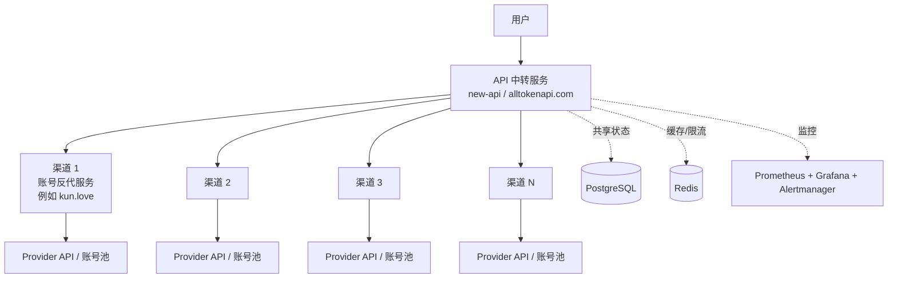

# AI API 网关线上容量评估与扩容方案

> 文档状态：线上压测前方案
>
> 适用范围：用户 -> API 中转服务（new-api）-> 多个渠道代理 -> Provider API 的架构。
>
> 重要边界：本文给出的本地压测结果只用于验证压测链路和发现资源瓶颈，不能直接作为线上容量承诺。

## 1. 目标与结论摘要

本次工作分两步：

1. 测出线上现有架构的稳定容量，重点指标是每秒完成的有效输出 Token 数（Token TPS），同时记录 RPS、并发、延迟和错误率。
2. 根据单节点稳定容量设计平行扩容，决定 API 网关、渠道代理、PostgreSQL、Redis 分别采用多少台、什么规格。

当前建议：

- 线上不要直接从 10,000 用户突发开始。先做 100 -> 250 -> 500 -> 1,000 -> 2,500 -> 5,000 -> 7,500 -> 10,000 的阶梯压测。
- API 网关和渠道代理优先采用多台中等规格节点，便于按 Provider、账号池、地域和 IP 分组扩展。
- PostgreSQL 和 Redis 属于共享状态组件，优先少量高规格、NVMe 和高可用部署；它们不能简单按增加 API 节点线性复制。
- 任一层达到饱和，整体有效容量都以该层为准。Provider 的 TPM/RPM、账号/IP 限制也必须纳入容量上限。

## 2. 现状架构



### 组件职责

| 层 | 主要职责 | 主要瓶颈 |
| --- | --- | --- |
| API 中转服务 | 鉴权、计费、路由、限流、请求/响应转换、日志 | CPU、内存、连接池、GC、网络、DB/Redis 等待 |
| 渠道代理 | 账号池、Provider 协议转换、重试、TLS、Provider 限流 | CPU、并发连接、出口带宽、Provider 限制 |
| PostgreSQL | 用户、渠道、计费、日志和配置 | CPU、IOPS、连接数、锁等待、WAL/磁盘 |
| Redis | 缓存、分布式限流、短期状态 | 单线程 CPU、内存、连接数、命令延迟 |
| Provider | 最终模型调用和 Token 产生 | TPM/RPM、并发、账号/IP 配额和上游延迟 |

## 3. 容量指标定义

### 3.1 Token TPS

统一以 Provider 返回的 usage 为准：

```text
output_token_tps = sum(completion_tokens) / 测试窗口秒数
input_token_tps  = sum(prompt_tokens) / 测试窗口秒数
total_token_tps  = (prompt_tokens + completion_tokens) / 测试窗口秒数
```

如果上游没有返回 usage，测试报告必须标记为估算值，不能与真实 Token TPS 混用。建议同时记录：

- `RPS`：每秒完成请求数
- `concurrency`：并发请求数和活跃 SSE 连接数
- `TTFB`：首字节时间
- `request_duration`：完整请求耗时
- `tokens_per_request`：输入、输出、总 Token/请求
- `error_rate`：HTTP 5xx、网关业务错误、Provider 429/5xx 分开统计

### 3.2 有效容量

```text
系统有效 Token TPS = min(
  网关稳定 Token TPS,
  渠道代理稳定 Token TPS,
  PostgreSQL 可承载的请求结算能力,
  Redis 可承载的限流/缓存能力,
  Provider TPM/RPM 与账号/IP 配额
)
```

稳定容量不是刚好出现错误时的峰值。建议取满足 SLO 且持续 30 分钟的最大平台值，再乘 0.7 作为生产安全容量。

## 4. 压测设计

### 4.1 流量模型

至少准备四类请求：

1. 非流式聊天：验证鉴权、计费、路由和完整响应。
2. 流式聊天：验证长连接、SSE、首字节和并发连接。
3. 模型列表/健康检查：验证轻量读请求是否被聊天流量拖慢。
4. 混合流量：建议 70% 流式、20% 非流式、10% 模型列表，比例按线上真实访问日志修正。

请求体必须固定或按真实分布生成，并固定模型、温度、最大输出 Token；每个阶段记录输入/输出 Token 分布。压测账号和渠道必须是专用资源，禁止复用真实用户余额和生产 Provider 账号。

### 4.2 阶梯与稳定性阶段

每个阶段分为 ramp-up、hold、ramp-down：

| 阶段 | 目标并发 | 建议 ramp-up | 建议 hold |
| --- | ---: | ---: | ---: |
| A | 100 | 2 分钟 | 10 分钟 |
| B | 250 | 2 分钟 | 10 分钟 |
| C | 500 | 3 分钟 | 15 分钟 |
| D | 1,000 | 5 分钟 | 30 分钟 |
| E | 2,500 | 5 分钟 | 30 分钟 |
| F | 5,000 | 10 分钟 | 30 分钟 |
| G | 7,500 | 10 分钟 | 30 分钟 |
| H | 10,000 | 15 分钟 | 30 分钟 |

达到以下任意条件，停止继续升压并记录饱和点：

- 错误率连续 5 分钟超过 1%，或出现大量 429/5xx。
- P95/P99 连续上升且无法回落，或超过业务 SLO。
- Redis timeout、PostgreSQL pool wait、连接拒绝持续出现。
- Provider 限额先于系统资源达到上限。
- 负载发生器本身 CPU、内存、网络或文件描述符耗尽。

### 4.3 突发与长稳

- Spike：10 秒内从 50 升到目标并发，保持 5 分钟，验证队列、连接池和告警。
- Burst：目标用户各发 1 次请求，观察瞬时 RPS 和丢失率。
- Soak：500~1,000 并发持续 2~4 小时，检查 Go heap、goroutine、连接数和日志增长。
- 故障演练：暂停一个渠道节点、注入 Provider 429/5xx、短暂阻断 Redis 或数据库，确认降级、重试和告警。

## 5. 监控与告警

### 5.1 Grafana 必看面板

1. 流量：RPS、活跃并发、流式连接、输入/输出/总 Token TPS。
2. 延迟：TTFB P50/P95/P99、完整响应 P50/P95/P99、Provider 上游延迟。
3. 错误：HTTP 4xx/5xx、业务错误、Provider 429/5xx、超时和重试次数。
4. API 网关：CPU、RSS、Go heap、GC pause、goroutine、in-flight、文件描述符。
5. 数据库：连接池 in-use/idle、wait count/wait duration、事务耗时、锁等待、慢查询、磁盘 IOPS。
6. Redis：命令延迟、连接数、pool timeout、blocked clients、内存、evicted/rejected connections。
7. 容器/主机：CPU throttling、内存 working set、网络吞吐、磁盘空间和 IO wait。
8. Provider/渠道：按渠道、模型、账号池、出口 IP 分组的 RPS、Token、429、5xx、超时。

### 5.2 建议告警

| 告警 | 条件（持续时间） | 处理动作 |
| --- | --- | --- |
| 网关错误率高 | 5xx 或业务错误 > 1%（5 分钟） | 停止升压，查应用日志和上游错误 |
| 延迟超 SLO | P95 > 2s 或流式 TTFB P95 > 1s（5 分钟） | 对照 CPU、DB/Redis wait、Provider 延迟定位 |
| DB 连接池紧张 | in-use/Max > 80% 或 wait count 持续增长 | 降并发，检查慢查询和连接泄漏；不要盲目加池 |
| Redis timeout | pool timeout > 0 或命令延迟异常（2 分钟） | 降并发，检查 Redis CPU、网络和热点 key |
| Provider 限额 | 429 比例 > 1%（5 分钟） | 分散账号/IP/渠道或申请更高配额 |
| 资源耗尽 | CPU > 85%、内存 > 85% 或 OOM | 停止测试并扩容/限流 |
| 监控链路异常 | exporter/Prometheus/Alertmanager 不可用 | 测试结果标记为无效，先修复观测链路 |

告警必须包含：环境、测试阶段、目标并发、当前 RPS、Token TPS、错误率、P95、责任节点和 Grafana 链接。告警恢复也要通知，避免只知道触发不知道恢复。

## 6. 本地压测结果与解释

### 1,000 用户 burst

- 1,000 请求全部完成，HTTP 错误率 0%。
- 约 434 RPS，P95 约 1.11 秒，TTFB P95 约 1.10 秒。
- PostgreSQL 连接池从 200 调整为 80 后，解决 `too many clients already`。

这说明本地链路在该规模下可运行，但不能外推线上 Token TPS，因为本地使用的是确定性 Mock Provider，且 Colima、数据库和监控都与生产不同。

### 10,000 用户 burst

- 10,000 VU 成功启动，但本地 Colima 只有 2 CPU / 4 GB RAM。
- 完成约 9,049 个响应后，k6 被系统以 exit 137 终止；剩余内存约 31 MB。
- Prometheus remote write 出现 timeout，Redis 出现 I/O timeout，数据库等待累计约 4.4 万次。
- 应用指标最终记录 10,000 个 relay 200，但 k6 没有完整收到并输出结果。

结论：该次测试主要测到了本地负载发生器和观测栈的资源上限，不是线上 API 网关的容量上限。不要把它作为线上承诺，也不要直接在生产执行 10,000 并发突发。

## 7. 线上部署与机器规格建议

以下是线上压测前的起步建议，最终规格以阶梯压测数据为准：

| 组件 | 起步规格 | 推荐规格 | 扩容方式 |
| --- | --- | --- | --- |
| API 网关 | 4 vCPU / 8 GB / SSD | 8 vCPU / 16 GB，至少 2 节点 | 多台中型，负载均衡无状态扩展 |
| 渠道代理 | 2~4 vCPU / 4~8 GB | 4~8 vCPU / 8~16 GB | 按 Provider/账号/IP 分组横向扩展 |
| PostgreSQL | 8 vCPU / 32 GB / NVMe | 16 vCPU / 64 GB / 高 IOPS NVMe | 少量高配，主从/故障切换，连接池 |
| Redis | 4 vCPU / 16 GB | 8 vCPU / 32 GB | 主从/哨兵或集群，按容量和吞吐扩展 |
| 负载发生器 | 4 vCPU / 8 GB | 8 vCPU / 16 GB | 10k VU 以上分布式 k6 |
| 监控栈 | 4 vCPU / 8 GB | 8 vCPU / 16 GB | 与业务隔离，远端长期存储 |

网络建议至少 1 Gbps，生产压测和业务出口分离。API 网关节点保持无状态；会话、限流和短期状态放 Redis，持久数据放 PostgreSQL。数据库连接池必须按数据库 `max_connections` 统一规划，先观察 wait，再决定是否增加连接。

### 多台小机器还是少量大机器

推荐混合策略：

- API 网关、渠道代理、负载发生器：多台中等规格。优点是故障域小、可滚动扩容、易按渠道隔离 Provider 限制。
- PostgreSQL、Redis：少量高规格并做高可用。优点是避免共享状态分片过早、降低一致性和运维复杂度。
- 当单个渠道的出口 IP、连接数或 Provider 配额成为瓶颈时，再增加渠道节点或独立出口 IP，而不是只增加 API 网关节点。

## 8. 容量计算与扩容公式

单节点安全容量：

```text
单节点生产安全 Token TPS = 单节点稳定 Token TPS × 0.7
```

目标容量下的 API/渠道节点数：

```text
节点数 = ceil(目标 Token TPS / 单节点稳定 Token TPS / 0.7) + 1（故障冗余）
```

示例：若单个渠道节点在 SLO 内稳定 2,000 Token TPS，目标为 10,000 Token TPS：

```text
ceil(10,000 / 2,000 / 0.7) + 1 = 9 台（含冗余）
```

实际计算还要同时满足：

- 每个 Provider 的 TPM/RPM 和账号数；
- 每个出口 IP 的并发、连接和限速；
- 数据库每秒事务数和锁等待；
- Redis 命令吞吐和网络带宽；
- 业务 SLO（错误率、P95/P99、TTFB）。

## 9. 线上压测执行清单

### 压测前

- 建立独立的压测租户、API Token、渠道和 Provider 账号池。
- 明确压测时间窗、最大并发、最大 Token、停止条件和回滚联系人。
- 确认业务出口与压测出口隔离，避免影响真实用户。
- 确认 Prometheus、Grafana、Alertmanager、日志、Trace、pprof/Pyroscope 均可访问。
- 预热数据库缓存和连接池；检查磁盘、备份和限流配置。

### 压测中

- 先 smoke，再阶梯，再 steady/soak，最后才做 spike/burst。
- 每个阶段至少保留 5~10 分钟稳定窗口，导出 k6 summary、Prometheus 数据和告警记录。
- 同时观察业务指标和压测机指标，压测机饱和时该阶段结果无效。
- 任何停止条件触发，立即降压，不要通过继续加机器掩盖 Provider 或数据库瓶颈。

### 压测后

- 核对请求总数、成功数、Provider usage 总 Token 和网关结算 Token 是否一致。
- 对照资源曲线找出第一个饱和层，记录该层的稳定 RPS、Token TPS、P95/P99 和错误率。
- 清理压测数据、临时账号、日志和监控标签；确认业务流量已恢复。
- 输出容量报告：当前容量、保守容量、瓶颈证据、扩容动作和复测结果。

## 10. 推荐决策顺序

1. 先在线上非生产或低风险时间窗测出单 API 网关节点和单渠道节点的稳定 Token TPS。
2. 固定网关节点数，增加渠道节点，确认渠道层是否线性扩展。
3. 固定渠道节点数，增加网关节点，确认 DB/Redis 是否成为共享瓶颈。
4. 用 Provider 真实 TPM/RPM 和账号/IP 配额修正理论容量。
5. 按保守容量的 70% 做日常运行水位，并至少保留 1 个节点故障冗余。

最终产物应包含一张容量表：

| 版本/配置 | 稳定并发 | 稳定 RPS | 输入 Token TPS | 输出 Token TPS | P95 | 错误率 | 首个瓶颈 |
| --- | ---: | ---: | ---: | ---: | ---: | ---: | --- |
| 待线上实测 | - | - | - | - | - | - | - |

