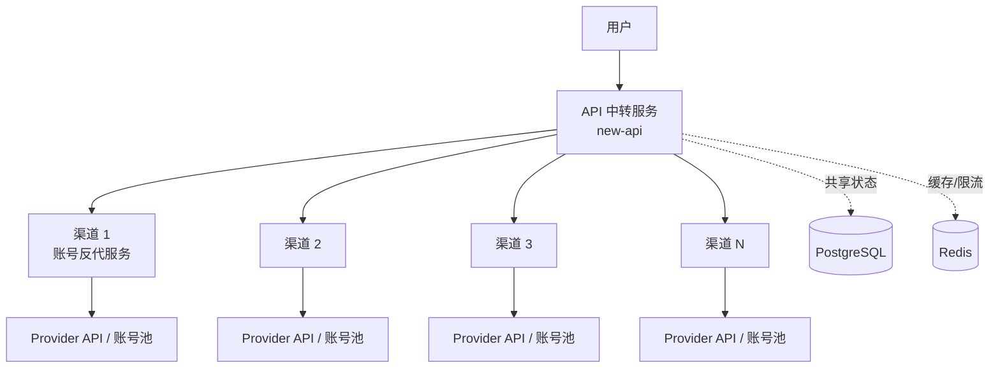

# AI API 网关线上容量评估与扩容方案

> 文档状态：线上压测前方案
>
> 适用范围：用户 -> API 中转服务（new-api）-> 多个渠道代理 -> Provider API。
>
> 重要边界：本地压测只用于验证压测链路和发现资源瓶颈，不能直接作为线上容量承诺。

## 1. 目标与结论摘要

本次工作分两步：

1. 测出线上现有架构的稳定容量，重点指标是每秒完成的有效输出 Token 数（Token TPS），同时记录 RPS、并发、延迟和错误率。
2. 根据单节点稳定容量设计平行扩容，决定 API 网关、渠道代理、PostgreSQL、Redis 分别采用多少台、什么规格。

当前建议：

- 线上不要直接从 10,000 用户突发开始，应按 100 -> 250 -> 500 -> 1,000 -> 2,500 -> 5,000 -> 7,500 -> 10,000 阶梯升压。
- API 网关和渠道代理优先使用多台中等规格节点，便于按 Provider、账号池、地域和 IP 分组扩展。
- PostgreSQL 和 Redis 属于共享状态组件，优先少量高规格、NVMe 和高可用部署，不能简单随 API 节点线性复制。
- 任一层达到饱和，整体有效容量都以该层为准；Provider 的 TPM/RPM、账号和 IP 限制也必须计入容量上限。

## 2. 现状架构



| 层 | 主要职责 | 主要瓶颈 |
| --- | --- | --- |
| API 中转服务 | 鉴权、计费、路由、限流、转换、日志 | CPU、内存、连接池、GC、网络、DB/Redis 等待 |
| 渠道代理 | 账号池、协议转换、重试、TLS、Provider 限流 | CPU、并发连接、出口带宽、Provider 限制 |
| PostgreSQL | 用户、渠道、计费、日志和配置 | CPU、IOPS、连接数、锁等待、WAL/磁盘 |
| Redis | 缓存、分布式限流、短期状态 | 单线程 CPU、内存、连接数、命令延迟 |
| Provider | 最终模型调用和 Token 产生 | TPM/RPM、并发、账号/IP 配额和上游延迟 |

## 3. 容量指标定义

统一以 Provider 返回的 usage 为准：

```text
output_token_tps = sum(completion_tokens) / 测试窗口秒数
input_token_tps  = sum(prompt_tokens) / 测试窗口秒数
total_token_tps  = (prompt_tokens + completion_tokens) / 测试窗口秒数
```

如果上游没有返回 usage，报告必须标记为估算值，不能与真实 Token TPS 混用。同时记录：

- RPS：每秒完成请求数
- concurrency：并发请求数和活跃 SSE 连接数
- TTFB：首字节时间
- request duration：完整请求耗时
- tokens per request：输入、输出、总 Token/请求
- error rate：HTTP 5xx、网关业务错误、Provider 429/5xx 分开统计

系统有效容量取各层上限的最小值。稳定容量不是刚好出现错误时的峰值，建议取满足 SLO 且持续 30 分钟的最大平台值，再乘 0.7 作为生产安全容量。

## 4. 压测设计

仓库提供 `run-remote.sh`，要求专用远程 Token、目标 URL 和 `CONFIRM_REMOTE_LOADTEST=yes`，避免误把压测发送到未审批的地址。远程压测前还要明确预算、Provider 限额、停止条件和维护窗口。

至少准备四类请求：

1. 非流式聊天：验证鉴权、计费、路由和完整响应。
2. 流式聊天：验证长连接、SSE、首字节和并发连接。
3. 模型列表/健康检查：验证轻量读请求是否被聊天流量拖慢。
4. 混合流量：建议 70% 流式、20% 非流式、10% 模型列表，比例按真实访问日志修正。

请求体必须固定或按真实分布生成，并固定模型、温度、最大输出 Token。压测账号和渠道必须是专用资源，禁止复用真实用户余额和生产 Provider 账号。

### 阶梯与稳定性阶段

| 阶段 | 目标并发 | 建议 ramp-up | 建议 hold |
| --- | ---: | ---: | ---: |
| A | 100 | 2 分钟 | 10 分钟 |
| B | 250 | 2 分钟 | 10 分钟 |
| C | 500 | 3 分钟 | 15 分钟 |
| D | 1,000 | 5 分钟 | 30 分钟 |
| E | 2,500 | 5 分钟 | 30 分钟 |
| F | 5,000 | 10 分钟 | 30 分钟 |
| G | 7,500 | 10 分钟 | 30 分钟 |
| H | 10,000 | 15 分钟 | 30 分钟 |

达到以下任意条件，应停止继续升压并记录饱和点：

- 错误率连续 5 分钟超过 1%，或出现大量 429/5xx。
- P95/P99 连续上升且无法回落，或超过业务 SLO。
- Redis timeout、PostgreSQL pool wait、连接拒绝持续出现。
- Provider 限额先于系统资源达到上限。
- 负载发生器本身 CPU、内存、网络或文件描述符耗尽。

补充场景：Spike 验证瞬时升压；Burst 验证瞬时 RPS；Soak 检查 heap、goroutine、连接数和日志增长；故障演练验证渠道切换、重试和降级。

## 5. 数据收集与停止条件

本仓库保留 k6 summary、应用日志和 pprof 作为压测证据。基础设施资源数据应由目标环境已有的主机、容器、数据库和 Redis 运维工具采集，不在此压测栈内启动额外监控服务。

每个阶段至少记录：

- k6 的请求数、错误率、P50/P95/P99、TTFB、dropped iterations
- Provider usage 汇总与网关结算 Token
- API 网关和渠道代理的 CPU、RSS、连接数、文件描述符、网络吞吐
- PostgreSQL 连接数、等待、慢查询、锁和磁盘 I/O
- Redis 命令延迟、连接数、内存、拒绝连接和 timeout
- Provider 的 429/5xx、TPM/RPM 和账号/IP 水位

典型停止条件：错误率 > 1% 持续 5 分钟；P95 超过业务 SLO；数据库或 Redis 等待持续增长；CPU/内存超过安全水位；Provider 429 持续出现；负载发生器自身饱和。

## 6. 本地压测结果的解释边界

本地确定性 Mock Provider 可以验证请求链路、k6 脚本、计费和故障转移，但不能外推线上 Token TPS。Colima、Docker、数据库和负载发生器共享本机资源时，最先达到的可能是本地资源上限，而不是 API 网关容量上限。

任何被负载发生器 OOM、网络耗尽或 dropped iterations 主导的阶段都应标记为无效。必须在目标环境复测，才能形成线上容量结论。

## 7. 线上部署与机器规格建议

| 组件 | 起步规格 | 推荐规格 | 扩容方式 |
| --- | --- | --- | --- |
| API 网关 | 4 vCPU / 8 GB / SSD | 8 vCPU / 16 GB，至少 2 节点 | 多台中型，负载均衡无状态扩展 |
| 渠道代理 | 2~4 vCPU / 4~8 GB | 4~8 vCPU / 8~16 GB | 按 Provider/账号/IP 分组横向扩展 |
| PostgreSQL | 8 vCPU / 32 GB / NVMe | 16 vCPU / 64 GB / 高 IOPS NVMe | 少量高配，主从/故障切换，统一连接池 |
| Redis | 4 vCPU / 16 GB | 8 vCPU / 32 GB | 主从/哨兵或集群，按容量和吞吐扩展 |
| 负载发生器 | 4 vCPU / 8 GB | 8 vCPU / 16 GB | 10k VU 以上使用分布式 k6 |

API 网关、渠道代理和负载发生器适合多台中等规格；PostgreSQL、Redis 适合少量高规格并做高可用。当单个渠道的出口 IP、连接数或 Provider 配额成为瓶颈时，应增加渠道节点或独立出口 IP，而不是只增加 API 网关节点。

## 8. 容量计算与扩容公式

```text
单节点生产安全 Token TPS = 单节点稳定 Token TPS × 0.7
节点数 = ceil(目标 Token TPS / 单节点稳定 Token TPS / 0.7) + 1（故障冗余）
```

实际计算还要同时满足 Provider TPM/RPM、账号数、出口 IP 限制、数据库事务能力、Redis 吞吐、网络带宽和业务 SLO。

## 9. 执行清单

压测前：

- 建立独立压测租户、Token、渠道和 Provider 账号池。
- 明确时间窗、最大并发、最大 Token、停止条件和回滚联系人。
- 确认业务出口与压测出口隔离。
- 确认日志、资源采集和 pprof 可用。
- 预热数据库缓存和连接池，检查磁盘、备份和限流配置。

压测中：

- 先 smoke，再阶梯，再 steady/soak，最后做 spike/burst。
- 每个阶段至少保留 5~10 分钟稳定窗口并保存 k6 summary。
- 同时观察业务端和压测机资源，压测机饱和时结果无效。
- 任一停止条件触发后立即降压。

压测后：

- 核对请求总数、成功数、Provider usage 和网关结算 Token。
- 找出第一个饱和层，记录稳定 RPS、Token TPS、P95/P99 和错误率。
- 清理压测数据、临时账号和日志，确认业务流量恢复。
- 输出容量报告：当前容量、保守容量、瓶颈证据、扩容动作和复测结果。

最终容量表：

| 版本/配置 | 稳定并发 | 稳定 RPS | 输入 Token TPS | 输出 Token TPS | P95 | 错误率 | 首个瓶颈 |
| --- | ---: | ---: | ---: | ---: | ---: | ---: | --- |
| 待线上实测 | - | - | - | - | - | - | - |
