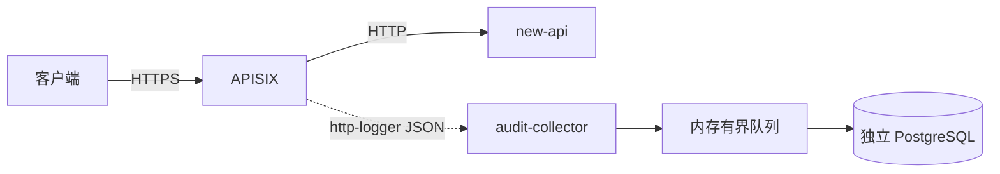

# APISIX HTTP 请求与响应存储方案

> 文档状态：设计完成，尚未部署
>
> 设计日期：2026-09-17
>
> 适用范围：保存 `客户端 <=> new-api` 的 HTTP 请求和响应

## 1. 结论

采用以下架构：

```text
客户端
  -> APISIX
       -> new-api
       -> http-logger -> audit-collector -> 独立 PostgreSQL
```

组件职责严格限定为：

| 组件 | 职责 |
| --- | --- |
| APISIX | 替换现有 Nginx/OpenResty，负责 TLS、路由、反向代理和请求/响应正文采集 |
| `http-logger` | 把匹配路由的 HTTP 请求和响应作为 JSON 异步发送给 collector |
| `audit-collector` | 接收 APISIX JSON，放入内存队列，由后台 worker 异步写 PostgreSQL |
| 独立 PostgreSQL | 不做业务拆分或派生，将 APISIX 日志对象保存为 JSONB |
| new-api | 保持现有业务、鉴权、计费和上游转发逻辑，不负责保存完整请求/响应 |

第一阶段不做：

- SSE 内容重组；
- 用户问题提取；
- AI 最终回答提取；
- tool call、usage、finish reason 等协议解析；
- 幂等去重；
- 本地 WAL；
- 字段脱敏；
- 指标和告警；
- 对象存储；
- 全文检索；
- 按用户或租户的数据治理。

collector 不做业务字段拆分或变换，将 APISIX `http-logger` 发来的 JSON 对象直接保存为 PostgreSQL JSONB。JSONB 保留字段和值，但不保证保留原始字节、空白、键顺序或重复键。

## 2. 数据边界

保存的是 APISIX 在公网入口观察到的内容：

```text
客户端发送给 APISIX 的 HTTP 请求
APISIX 从 new-api 获得并返回客户端的 HTTP 响应
```

不保存：

```text
new-api -> 上游模型供应商的请求
上游模型供应商 -> new-api 的原始响应
new-api 内部模型转换
渠道选择
失败重试过程
计费计算过程
```

对于 SSE，APISIX 保存的是原始响应文本，例如：

```text
data: {"choices":[{"delta":{"content":"你"}}]}

data: {"choices":[{"delta":{"content":"好"}}]}

data: [DONE]

```

collector 不解释这些内容，只把整个 `response.body` 字符串写入 PostgreSQL。

## 3. 总体架构



### 3.1 部署单元

建议使用三个独立部署目录：

```text
/opt/new-api/           new-api 应用
/opt/new-api-gateway/   APISIX 网关
/opt/new-api-audit/     audit-collector
```

三者分别发布和回滚，不能把 APISIX 替换或 collector 发布塞进现有 `deploy-binary.sh`。

### 3.2 网络

```text
APISIX
  ├─ 应用网络：访问 new-api:3000
  └─ 审计网络：访问 audit-collector:8080

audit-collector
  ├─ 审计网络：只接受 APISIX 请求
  └─ 访问独立 PostgreSQL
```

- collector 不开放公网端口。
- PostgreSQL 是独立数据库，不使用 new-api 主数据库和账号。
- APISIX 是否加入现有 Docker 网络必须在部署前现场确认。

## 4. APISIX 部署方案

### 4.1 部署模式

第一阶段使用 APISIX Standalone file-driven 模式：

```yaml
deployment:
  role: data_plane
  role_data_plane:
    config_provider: yaml
```

选择该模式的原因：

- 单节点网关不需要 etcd；
- 配置文件可以进入代码审查；
- 配置更新可以热加载；
- 不需要暴露 Admin API；
- 部署和回滚方式简单。

`apisix.yaml` 必须以 `#END` 结束。

### 4.2 版本和目录

设计基线为 APISIX `3.18.0-debian`。实际部署时重新确认批准版本，并固定版本和镜像 digest，禁止使用 `latest`。

建议运行目录：

```text
/opt/new-api-gateway/
  docker-compose.yml
  conf/
    config.yaml
    apisix.yaml
  snapshots/
  .gateway-release
  .gateway-config-sha
```

建议后续在仓库增加：

```text
deploy/apisix/
  docker-compose.yml
  conf/config.yaml
  conf/apisix.yaml.template
  scripts/validate-config.sh
  scripts/deploy-gateway.sh
  README.md
```

本设计阶段不创建部署脚本。

### 4.3 路由范围

第一阶段只在以下文本接口启用 `http-logger`：

```text
POST /v1/completions
POST /v1/chat/completions
POST /v1/responses
POST /v1/responses/compact
POST /v1/messages
```

可选纳入：

```text
POST /pg/chat/completions
```

第一阶段不采集：

```text
GET  /v1/realtime
POST /v1/images/*
POST /v1/audio/*
POST /v1/video/*
POST /v1/embeddings
POST /v1/rerank
/mj/*
/suno/*
文件上传和下载
登录、注册、支付和管理接口
```

### 4.4 `http-logger` 配置

核心配置：

```yaml
http-logger:
  uri: "${{AUDIT_COLLECTOR_URI}}"
  auth_header: "$ENV://AUDIT_COLLECTOR_AUTH"
  include_req_body: true
  include_resp_body: true
  max_req_body_bytes: 524288
  max_resp_body_bytes: 524288
  concat_method: json
  timeout: 2
  batch_max_size: 1
  max_retry_count: 3
  retry_delay: 1
  log_format_extra:
    gateway_request_id: "$request_id"
    gateway_instance_id: "${{GATEWAY_INSTANCE_ID}}"
    environment: "${{DEPLOY_ENV}}"
```

选择 `batch_max_size=1` 后，每次请求发送一个 JSON object，collector 不需要处理 JSON array 或 NDJSON。

正文上限初始保持官方默认值 512 KiB。上线前通过真实请求确认是否足够；需要调大时必须同时验证 APISIX worker 内存。

近似内存量级：

```text
响应正文副本内存
≈ 每 worker 活跃审计请求数 × 单请求已捕获响应字节

待发送日志内存
≈ 每 worker pending 日志数 × 单条日志平均大小
```

### 4.5 APISIX 配置骨架

`config.yaml`：

```yaml
apisix:
  node_listen: 9080
  enable_ipv6: false

deployment:
  role: data_plane
  role_data_plane:
    config_provider: yaml
```

`apisix.yaml.template`：

```yaml
upstreams:
  - id: new-api
    type: roundrobin
    nodes:
      "${{NEW_API_UPSTREAM}}": 1
    timeout:
      connect: 10
      send: 600
      read: 600

plugin_configs:
  - id: ai-http-audit
    plugins:
      http-logger:
        uri: "${{AUDIT_COLLECTOR_URI}}"
        auth_header: "$ENV://AUDIT_COLLECTOR_AUTH"
        include_req_body: true
        include_resp_body: true
        max_req_body_bytes: 524288
        max_resp_body_bytes: 524288
        concat_method: json
        timeout: 2
        batch_max_size: 1
        max_retry_count: 3
        retry_delay: 1
        log_format_extra:
          gateway_request_id: "$request_id"
          gateway_instance_id: "${{GATEWAY_INSTANCE_ID}}"
          environment: "${{DEPLOY_ENV}}"

routes:
  - id: new-api-text-audit
    priority: 100
    uris:
      - /v1/completions
      - /v1/chat/completions
      - /v1/responses
      - /v1/responses/compact
      - /v1/messages
    methods:
      - POST
    plugin_config_id: ai-http-audit
    upstream_id: new-api

  - id: new-api-catch-all
    priority: 0
    uri: /*
    upstream_id: new-api

# TLS 配置根据目标服务器当前证书管理方式生成。
#END
```

该配置只是设计骨架，正式部署前必须用目标 APISIX 版本校验。Gemini `/v1beta/models/*` 包含多种操作，第一阶段不使用宽泛通配路由采集；如需纳入，必须先验证能只匹配 `generateContent` 和 `streamGenerateContent` 的 route/vars 规则。

### 4.6 TLS 和公网入口

切换前现场确认：

- 80/443 当前监听进程；
- OpenResty/Nginx 配置和启动方式；
- TLS 证书位置、SNI 和续期方式；
- HTTP 到 HTTPS 跳转；
- HTTP/2；
- 上传大小；
- 代理读写超时；
- 客户端真实 IP 传递。

TLS 私钥和 collector 密钥不写入仓库。APISIX、collector 和 new-api 分别使用自己的配置和环境变量文件。

## 5. audit-collector 设计

### 5.1 职责

collector 只做四件事：

1. 接收 APISIX `http-logger` 的 HTTP POST。
2. 检查认证和 JSON 是否有效。
3. 把日志对象放入有界内存队列。
4. 后台 worker 异步插入独立 PostgreSQL JSONB。

不做：

- SSE 解析；
- 请求协议解析；
- 用户问题提取；
- AI 回答提取；
- Header 或正文脱敏；
- 幂等去重；
- 本地 WAL；
- 指标和告警；
- 重放和 dead-letter。

### 5.2 接收接口

```text
POST /v1/audit/events
Content-Type: application/json
Authorization: <collector secret>
```

目标 APISIX 3.18.0 在 `batch_max_size=1`、`concat_method=json` 时发送单个 JSON object；candidate 阶段必须抓取实际 HTTP payload 验证这一点。为避免版本差异造成不可用，collector 可以同时接受单个 object 和单元素 array，不支持多事件批量和 NDJSON。

响应：

| 状态 | 含义 |
| --- | --- |
| `202` | JSON 已进入内存队列，等待异步写数据库 |
| `400` | JSON 无效 |
| `401/403` | collector 认证失败 |
| `413` | 请求超过 collector HTTP body 上限 |
| `503` | 内存队列已满或服务正在关闭 |

collector 返回 `202` 后，如果进程在数据库写入前崩溃，该条记录会丢失。这是第一阶段明确接受的限制。

### 5.3 异步写入流程

```text
HTTP handler
  -> 限制请求大小
  -> 验证 JSON object 或单元素 array
  -> 保留 JSON 对象
  -> 写入 buffered channel
  -> 返回 202

DB worker
  -> 从 channel 读取
  -> INSERT PostgreSQL
  -> 成功后处理下一条
  -> 失败时等待后重试当前记录
```

队列必须是有界 channel，不能无限增长。队列满时返回 `503`，由 APISIX 的 `max_retry_count` 和 `retry_delay` 处理短期重试。

### 5.4 健康接口

只保留部署所需的基础健康检查：

```text
GET /healthz
```

返回 `200` 表示：

- HTTP 服务正在运行；
- 内存队列仍可接收；
- PostgreSQL 连接配置已经初始化。

不建设 Prometheus 指标和告警系统。

### 5.5 Collector 部署形式

建议独立 Go 二进制和独立容器：

```text
/opt/new-api-audit/
  docker-compose.yml
  audit-collector
  .env
```

- `.env` 只包含 collector 自己的配置和独立 PostgreSQL连接信息。
- 不复制 `/opt/new-api/.env`。
- collector 只在 Docker 私有网络暴露 `8080`。
- APISIX 使用内部服务名访问 collector。
- collector 使用固定版本镜像或本地构建的版本化镜像。

## 6. 数据保存方案

### 6.1 数据库

使用独立 PostgreSQL 数据库：

```text
数据库实例/服务：独立于 new-api 主数据库
数据库名称：new_api_audit
数据库账号：new_api_audit_writer
```

生产环境不在内存受限的公网网关主机新增 PostgreSQL 容器。数据库部署位置和凭据必须独立确认。

### 6.2 保存形式

一条 APISIX 日志对象保存为一行 JSONB，不做业务拆分、协议解析或字段派生：

```sql
CREATE TABLE gateway_http_logs (
    id BIGSERIAL PRIMARY KEY,
    received_at TIMESTAMPTZ NOT NULL DEFAULT NOW(),
    payload JSONB NOT NULL
);

CREATE INDEX idx_gateway_http_logs_received_at
    ON gateway_http_logs (received_at DESC);
```

collector 的写入语句只需要：

```sql
INSERT INTO gateway_http_logs (payload)
VALUES ($1::jsonb);
```

不创建用户消息表、AI 消息表、事件表或解析状态表。

查询请求体和响应体时直接读取原始 JSON：

```sql
SELECT
    received_at,
    payload ->> 'gateway_request_id' AS gateway_request_id,
    payload -> 'request' ->> 'uri' AS request_uri,
    payload -> 'request' ->> 'body' AS request_body,
    payload -> 'response' ->> 'body' AS response_body,
    (payload -> 'response' ->> 'status')::INTEGER AS response_status
FROM gateway_http_logs
ORDER BY id DESC
LIMIT 100;
```

### 6.3 数据示例

数据库中的 `payload` 保留 APISIX 日志对象的字段和值。因为使用 JSONB，它不是字节级原样副本，不保留 JSON 空白、键顺序和重复键：

```json
{
  "gateway_request_id": "gateway-request-id",
  "gateway_instance_id": "alltokenapi-gw-1",
  "environment": "production",
  "request": {
    "url": "https://example.com/v1/chat/completions",
    "uri": "/v1/chat/completions",
    "method": "POST",
    "headers": {
      "content-type": "application/json",
      "authorization": "Bearer ..."
    },
    "body": "{\"model\":\"example-model\",\"messages\":[{\"role\":\"user\",\"content\":\"用户问题\"}]}"
  },
  "response": {
    "status": 200,
    "headers": {
      "content-type": "text/event-stream",
      "x-oneapi-request-id": "new-api-request-id"
    },
    "body": "data: {...}\\n\\ndata: [DONE]\\n\\n"
  }
}
```

第一阶段不从 `request.body` 提取用户问题，也不从 `response.body` 提取 AI 回答。查询时直接读取原始字段。

### 6.4 明确接受的限制

由于第一阶段不做脱敏，数据库可能保存 APISIX 默认日志中的请求头、响应头以及请求/响应正文，包括 Authorization、Cookie 或用户正文中的敏感信息。

由于第一阶段不做本地 WAL 和幂等：

- collector 返回 `202` 后崩溃可能丢失队列数据；
- APISIX 重试可能产生重复记录；
- PostgreSQL 长时间不可用时，队列最终会满；
- APISIX 达到正文上限后会截断正文；
- SSE 保存为原始文本，不生成最终回答字段；
- 不提供按用户删除、正文检索和协议级完整性判断。

这些限制属于当前明确接受的设计取舍，不应在实现或部署报告中描述成已解决。

## 7. deploy-new-api skill 修改

部署 skill 已扩展到 APISIX 和 collector，但保持应用发布与网关发布解耦。

### 7.1 `SKILL.md`

包含：

- APISIX/OpenResty 网关迁移触发范围；
- app、gateway、collector 主机和部署范围确认；
- 生产网关、TLS、80/443、正文采集和 DNS 的独立授权；
- 应用、网关、collector 和切流分别回滚；
- new-api 原有数据库与独立 audit PostgreSQL 的授权边界；
- 涉及 APISIX 时读取专用 reference。

### 7.2 `references/apisix-audit-gateway.md`

作为部署操作手册，包含：

- 现场发现；
- Standalone 模式；
- route 和 `http-logger`；
- collector 部署；
- candidate 端口验证；
- 切流；
- OpenResty 回滚；
- collector 和 audit PostgreSQL 回滚。

### 7.3 `references/deployment-playbook.md`

增加网关/collector 部署范围和独立验证入口，不修改现有 new-api 二进制发布步骤。

### 7.4 `references/production-topology.md`

增加 active gateway、APISIX candidate、collector、audit PostgreSQL、TLS 和 rollback 的现场发现字段。

### 7.5 `references/incident-recovery.md`

增加：

- APISIX 路由故障；
- SSE 经 APISIX 异常；
- collector 或 audit PostgreSQL 不可用；
- 优先关闭 `http-logger`，而不是回滚 new-api。

### 7.6 `deploy-binary.sh`

保持不变。该脚本仍然只部署 new-api 应用。

## 8. 部署流程

### 阶段 1：部署独立 PostgreSQL

1. 确认数据库主机和授权。
2. 创建独立数据库和独立账号。
3. 执行 `gateway_http_logs` 建表 SQL。
4. 验证 collector 主机可以连接。
5. 不修改 new-api 现有数据库和账号。

### 阶段 2：部署 collector

1. 部署 collector 容器。
2. 配置 PostgreSQL连接和 APISIX 认证值。
3. 验证 `/healthz`。
4. POST 一个测试 JSON。
5. 确认 PostgreSQL新增一条原始 `payload`。
6. 连续发送多条事件，确认后台 worker 异步写入。
7. 暂停 PostgreSQL，确认队列会积压且满后返回 `503`。

### 阶段 3：部署 APISIX candidate

1. 在非 80/443 端口启动 APISIX。
2. 配置 new-api upstream。
3. 配置文本接口路由。
4. 启用 `http-logger`。
5. 使用 `curl --resolve`、Host header 或 canary 域名验证。
6. 不停止现有 OpenResty。

### 阶段 4：验收

至少验证：

- `/api/status`；
- 普通非流式请求；
- SSE 请求；
- 请求体已经进入 `payload.request.body`；
- 响应体已经进入 `payload.response.body`；
- SSE 响应仍然逐段返回客户端；
- collector 停止后 AI 请求仍成功；
- PostgreSQL 停止后 AI 请求仍成功；
- 请求超过正文上限后的截断行为；
- APISIX 配置 reload；
- 旧 OpenResty 可以恢复。

### 阶段 5：切换 80/443

优先使用可立即撤销的负载均衡或端口转发切换。

如果必须同机抢占端口，使用受控脚本执行：

```text
停止旧网关
  -> 启动 APISIX 80/443
  -> 本机健康检查
  -> 失败则自动停止 APISIX并恢复旧网关
```

切换后验证公网状态页、普通 AI 请求和 SSE。

### 阶段 6：回滚

按最小影响范围处理：

1. 只有日志异常：从目标 route 移除 `http-logger`。
2. APISIX 配置异常：恢复上一个 `apisix.yaml`。
3. APISIX 或 TLS 异常：恢复 OpenResty 80/443。
4. collector 异常：回滚 collector，或暂时关闭 `http-logger`。
5. audit PostgreSQL 异常：恢复数据库服务，或暂时关闭 `http-logger`。
6. direct new-api 也异常时，才执行现有应用镜像回滚。

## 9. 第一阶段实施清单

需要实现：

```text
1. APISIX Standalone Compose 和配置模板
2. 简单 Go audit-collector
3. 独立 PostgreSQL建表 migration
4. 测试环境 candidate 部署
5. 普通请求和 SSE 验收
6. 生产切流和 OpenResty 回滚脚本
```

不需要实现：

```text
SSE parser
AI 协议 parser
规范化消息表
脱敏模块
SQLite WAL
幂等模块
Prometheus metrics
告警
对象存储
全文搜索
用户级数据治理
```
