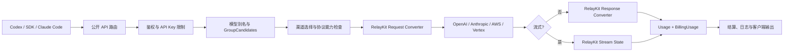

# OpenAI Responses、Chat Completions 与 Claude Messages 三协议互转设计

> - 文档状态：完整技术方案，待分阶段实现
> - 设计日期：2026-08-03
> - 当前 fork 基线：`482e48c1a7cad8001081c1cc607e7098ed4ca31a`
> - 官方 `QuantumNous/new-api` 基线：`0ab02020603d22e5613bc4cf46bfab06f8567769`
> - 目标客户端：Codex、Claude Code、OpenAI/Anthropic SDK 及兼容 Agent
> - 目标协议：`POST /v1/chat/completions`、`POST /v1/responses`、`POST /v1/messages`

## 1. 结论

本项目应继续采用服务端统一路由和协议转换，不把转换责任交给 CC Switch、Codex 或 Claude Code。

目标链路为：

```text
客户端协议
  -> 鉴权、模型别名、分组与渠道选择
  -> 协议能力检查
  -> RelayKit 请求转换
  -> 原生上游协议
  -> RelayKit 响应/流式事件转换
  -> 客户端原协议
  -> 使用量结算与日志
```

三种协议不能对所有字段做数学意义上的无损互转。完整方案必须定义一个可保证的兼容子集，并对状态型字段、无法等价的内置工具和不支持的媒体类型返回明确的 `400`，不能静默删除。

当前唯一缺失的主要 HTTP 链路是：

```text
Codex / OpenAI Responses 客户端
  -> POST /v1/responses
  -> 原生 Claude /v1/messages 上游
  -> Claude JSON 或 SSE
  -> OpenAI Responses JSON 或 SSE
```

项目中的转换注册表已经包含：

- Responses -> Claude Messages 的直接请求转换；
- Claude Messages -> Responses 的响应转换链；
- Chat Completions <-> Responses；
- Chat Completions <-> Claude Messages。

但 `relay/channel/claude/adaptor.go::ConvertOpenAIResponsesRequest` 仍返回 `not implemented`，Claude 响应处理器也只处理 Claude 和 Chat Completions 输出。因此，当前状态是“转换内核存在，但原生 Claude 通道没有接线”。

最终实施分为四个阶段：

1. 打通原生 Anthropic 的基础 Responses 请求、非流式响应和流式响应。
2. 在 RelayKit 内补齐 custom tool、thinking signature、`redacted_thinking`、`encrypted_content` 和 citations，避免在 adaptor 中复制转换逻辑。
3. 接入 AWS Bedrock Claude 与 Vertex Claude，并验证它们的包装协议和 usage 差异。
4. 视业务需要单独实现 Responses 状态存储；第一版继续明确拒绝 `previous_response_id`、`conversation` 等状态型能力。

## 2. 背景与问题

当前项目希望使用一把 API Key 和一个 new-api 地址，同时满足：

- Codex 使用 `/v1/responses` 调用 GPT 模型；
- Codex 使用 `/v1/responses` 调用 Claude 模型；
- Claude Code 使用 `/v1/messages` 调用 Claude 或可转换的 GPT 模型；
- 普通 OpenAI SDK 使用 `/v1/chat/completions`；
- 服务端根据模型别名、分组和渠道决定实际上游；
- 客户端不需要理解上游到底是 OpenAI、Anthropic、AWS 还是 Vertex。

CC Switch 只能管理客户端的 Base URL、API Key 和模型选择，不能完成以下工作：

- Responses 请求转换为 Claude Messages；
- Claude SSE 转换为 Responses SSE；
- 工具调用 ID、参数增量和事件顺序维护；
- thinking signature 与 `encrypted_content` 往返；
- provider usage 转成客户端 usage，同时保留真实计费语义；
- 流开始前和流开始后的错误转换；
- 重试、渠道亲和、分组计费和日志归因。

因此协议互转必须位于 new-api 的 relay 层。

## 3. 目标与非目标

### 3.1 目标

- 三个公开入口都能路由到经过声明的兼容上游。
- 客户端格式与上游格式不同时自动调用 RelayKit。
- 请求、非流式响应和流式响应使用同一套转换注册表。
- Codex 常用的文本、function tool、custom tool、多轮工具结果和 reasoning 可以通过原生 Claude 渠道工作。
- Claude 的 cache read、cache creation、5 分钟/1 小时缓存和 server tool usage 保持真实计费语义。
- 所有无法安全转换的字段在请求发送上游前失败。
- 原生 `/v1/messages` 和现有 Chat -> Claude 行为不发生回归。
- 支持在同一 API Key 下用不同模型别名稳定选择 GPT 或 Claude。

### 3.2 非目标

- 不承诺任意 provider 私有扩展字段都能互转。
- 第一版不实现 OpenAI Responses 服务端状态存储。
- 第一版不支持 `/v1/responses/compact` 转发到 Claude。
- 不把 `file_search`、`computer_use`、`image_generation` 等不同 provider 的工具伪装成完全等价能力。
- 不通过 CC Switch 在客户端侧转换协议。
- 不在 Claude adaptor 内再维护一套与 RelayKit 平行的转换器。
- 不让一次请求在重试时从 GPT 模型透明切换成 Claude 模型，或反向切换。

## 4. 设计原则

### 4.1 同协议直通，跨协议转换

只有客户端格式与上游格式一致时才允许 body passthrough：

```text
Responses -> Responses        可直通
Claude Messages -> Messages   可直通
Chat -> Chat                  可直通
Responses -> Claude           必须转换
Claude -> Responses           必须转换
```

全局 `PassThroughRequestEnabled` 和渠道 `PassThroughBodyEnabled` 不能覆盖这个规则。跨协议请求如果强制透传，会把 Responses JSON 原样发送到 `/v1/messages`，属于配置错误。

推荐行为：

- 同协议：按现有设置决定透传或结构化转发；
- 跨协议：忽略 body passthrough，始终结构化转换；
- 如果管理员配置了“必须原样透传”，则在本地返回配置冲突错误，不发送上游。

### 4.2 直接转换优先

转换路径优先级：

1. 原格式等于目标格式，不转换；
2. 存在直接转换器，使用直接转换；
3. 只在语义损失已知且可接受时使用经 Chat 的多跳转换；
4. `discouraged` 路径不得自动用于 Agent 流量。

Responses -> Claude 请求已经是直接转换。Claude -> Responses 响应当前经 Chat 中转，基础文本可用，但 thinking signature、custom tool 类型和部分事件语义会丢失。最终版本应把 Claude -> Responses 响应改成 RelayKit 内的直接转换器。

### 4.3 不静默丢字段

每个字段只能属于以下四类之一：

- `direct`：语义等价转换；
- `gateway-local`：不发给上游，但在网关内明确使用；
- `best-effort`：有文档说明的降级，并在转换质量中标记；
- `rejected`：返回 `400 invalid_request_error`。

禁止没有记录地删除客户端字段或工具。

### 4.4 协议输出与计费语义分离

客户端看到 OpenAI Responses 风格的 usage，不代表内部结算可以按 OpenAI usage 解释。

内部必须同时保留：

```text
客户端输出 usage      OpenAI Responses 语义
BillingUsage          Claude 原始 usage
UsageSource           anthropic / bedrock / vertex
FinalRequestFormat    claude
```

结算优先读取 `BillingUsage.ClaudeUsage`，不能根据已经转换过的 `input_tokens` 反推 Claude 缓存费用。

## 5. 当前实现基线

### 5.1 当前 fork

当前 fork 的转换代码位于：

- `service/relayconvert/request_registry.go`
- `service/relayconvert/response_registry.go`
- `service/relayconvert/text_converter_registry.go`
- `service/relayconvert/internal/oai_responses/`
- `service/relayconvert/internal/claude_messages/`

已存在的关键能力：

- `openai_responses_to_claude_messages` 是直接请求转换器；
- `claude_messages_to_openai_responses` 注册为 `fair` 多跳链；
- `NewResponseStreamState`、`ConvertStreamResponseChunk` 和 `FinalizeStreamResponse` 已存在；
- Claude usage 已能保留 `BillingUsage.ClaudeUsage`；
- Gemini adaptor 已演示 Responses 请求、非流式响应和流式响应的接线方式。

缺失项：

- `relay/channel/claude/adaptor.go::ConvertOpenAIResponsesRequest`；
- Claude `DoResponse` 对 `RelayFormatOpenAIResponses` 的分支；
- Claude -> Responses 直接非流式转换；
- Claude -> Responses 直接流式状态机；
- custom tool 类型恢复；
- thinking signature 和 `redacted_thinking` 往返；
- Anthropic 渠道的 Responses endpoint capability；
- AWS/Vertex Claude 的 Responses 请求入口。

### 5.2 官方 RelayKit 基线

官方 `main` 已将上述转换代码抽到：

- `relaykit/relayconvert/`
- `relaykit/dto/`
- `relaykit/types/`

正式实现前建议先同步官方 RelayKit extraction，避免在当前 `service/relayconvert` 路径完成大量改动后再次迁移。本文后续使用“RelayKit”指代转换内核；实施路径以代码同步后的实际目录为准。

## 6. 目标协议矩阵

表格中的质量是对声明兼容子集的评价，不代表所有 provider 私有字段都无损。

| 客户端协议 | Chat 上游 | Responses 上游 | Claude 上游 |
| --- | --- | --- | --- |
| Chat Completions | passthrough | 已有直接转换，`good` | 已有直接转换，`fair` |
| OpenAI Responses | 已有直接转换，`good` | passthrough | 本方案补全，目标 `good` 子集 |
| Claude Messages | 已有直接转换，`fair` | 已有策略链，需语义增强 | passthrough |

`good` 子集至少包含：

- 文本输入和输出；
- system/developer instructions；
- 图片和 PDF 输入；
- function tool 声明、调用、参数和结果；
- Codex custom tool 的可逆包装；
- 非流式与流式；
- usage、cache usage 和 `max_tokens` 终止；
- 可回放的 thinking/redacted thinking；
- 明确的错误和不支持字段处理。

## 7. 目标架构



### 7.1 组件职责

| 组件 | 职责 | 不负责 |
| --- | --- | --- |
| router/relay handler | 解析客户端协议、鉴权、调用 adaptor | provider 字段转换 |
| distributor/channel select | 按 group、model、endpoint capability 选渠道 | 修改请求体 |
| adaptor | 决定上游 URL、header、包装方式，调用 RelayKit | 自建第二套转换逻辑 |
| RelayKit request converter | DTO 到 DTO 的请求语义转换 | HTTP、计费扣款 |
| RelayKit response converter | DTO 到 DTO 的完整响应转换 | 读取网络流 |
| RelayKit stream state | SSE 事件状态、索引、参数缓冲、终态 | 渠道重试 |
| service billing | 预扣费、结算、日志 | 改写客户端协议 |

### 7.2 核心调用链

请求侧：

```go
result, err := relayconvert.ConvertRequest(
    c,
    info,
    types.RelayFormatClaude,
    &request,
)
```

非流式响应侧：

```go
result, err := relayconvert.ConvertResponse(
    c,
    info,
    types.RelayFormatOpenAIResponses,
    &claudeResponse,
)
```

流式响应侧：

```go
state, err := relayconvert.NewResponseStreamState(
    types.RelayFormatClaude,
    types.RelayFormatOpenAIResponses,
    options,
)

results, err := relayconvert.ConvertStreamResponseChunk(c, info, state, &chunk)
finalResults, err := relayconvert.FinalizeStreamResponse(c, info, state)
```

## 8. 路由与模型选择

### 8.1 一个 API Key 同时使用 GPT 和 Claude

推荐公开模型名：

```text
codex-gpt      -> GPT Responses 上游
codex-claude   -> Claude Messages 上游
```

或者直接保留互不冲突的 provider 模型名：

```text
gpt-5.x
claude-opus-x
claude-sonnet-x
```

不要把同一个公开模型名同时随机映射到 GPT 和 Claude。否则重试、成本、工具能力和 reasoning 语义都不可预测。

API Key 可以使用：

- `Group=auto`；
- 有序 `GroupCandidates`；
- 每个模型在目标分组中映射到确定上游；
- 需要确定性时关闭跨组重试。

Codex 客户端始终使用 Responses：

```toml
[model_providers.new_api]
base_url = "https://example.com/v1"
wire_api = "responses"
```

选择 GPT 或 Claude 只改变 `model`，不改变 `wire_api`。

Claude Code 继续使用服务根地址，由客户端追加 `/v1/messages`。

### 8.2 endpoint capability 必须参与选路

`SupportedEndpointTypes` 目前主要用于模型列表和定价展示，不能单独证明渠道在运行时可处理该 endpoint。

目标设计增加统一 capability 判断：

```text
Supports(channel, model, sourceFormat, endpointType) -> bool
```

该判断至少被以下位置复用：

- 渠道选择；
- `GET /v1/models` 的 `supported_endpoint_types`；
- pricing endpoint metadata；
- channel test 的路径与请求体选择；
- 管理后台的渠道能力展示。

第一阶段只为原生 Anthropic 声明 `openai-response`。AWS 和 Vertex 只有在 Claude request mode 完成端到端测试后才能声明，不能给整个 AWS/Vertex 渠道类型统一添加 Responses 能力。

## 9. Responses 请求到 Claude Messages 的映射

### 9.1 基础字段

| Responses 字段 | Claude 字段/行为 | 策略 |
| --- | --- | --- |
| `model` | `model`，在 ModelMappedHelper 后使用上游名 | direct |
| `instructions` | `system` text block | direct |
| `input` string | 首个 user text message | direct |
| `input[].role=user` | user message | direct |
| `input[].role=assistant` | assistant message | direct |
| `developer` / `system` role | 追加到 Claude system blocks | direct |
| `max_output_tokens` | `max_tokens` | direct |
| `temperature` | `temperature` 指针 | direct |
| `top_p` | `top_p` 指针 | direct |
| `stream` | `stream` 指针 | direct |
| `parallel_tool_calls` | `tool_choice.disable_parallel_tool_use` 的反值 | direct |
| `reasoning.effort` | Claude thinking 配置 | best-effort |
| `metadata` | 只转换 Claude 明确支持的 metadata | best-effort/rejected |

所有可选标量继续使用指针。显式 `0`、`0.0` 和 `false` 必须保留，不能因为 `omitempty` 被丢弃。

`max_output_tokens` 必须先经过现有 `maxTokensLimit` 校验，再转换为 `*uint max_tokens`。未提供时使用现有 Claude 默认 max tokens 设置，不能生成无限制或负数估算。

### 9.2 多模态输入

| Responses content | Claude block | 行为 |
| --- | --- | --- |
| `input_text` | `text` | direct |
| `output_text` 历史 | `text` | direct |
| `input_image` | `image` base64 source | direct |
| `input_file` 且 MIME 为 PDF | `document` base64 source | direct |
| 其它受支持文档类型 | 按 Claude 当前能力映射 | capability-gated |
| `input_audio` | 无等价能力 | rejected |
| `input_video` | 无等价能力 | rejected |

媒体 URL 继续使用现有 `ResolveBase64Data`，并保留 URL 安全、MIME、体积和读取超时限制。不能把 audio/video 统一伪装成 Claude image。

### 9.3 function tool

Responses function tool：

```json
{
  "type": "function",
  "name": "get_weather",
  "description": "Get weather",
  "parameters": {
    "type": "object",
    "properties": {}
  }
}
```

转换为：

```json
{
  "name": "get_weather",
  "description": "Get weather",
  "input_schema": {
    "type": "object",
    "properties": {}
  }
}
```

规则：

- 缺失 `type` 时补 `object`；
- 缺失 `properties` 时补空对象；
- 保留 `required`、`additionalProperties` 等 JSON Schema 字段；
- 同一请求中的 tool name 必须唯一；
- `function_call` 历史转为 assistant `tool_use`；
- `function_call_output` 转为 user `tool_result`；
- `call_id` 与 `tool_use_id` 原样对应。

### 9.4 Codex custom tool

Responses custom tool 的输入可能是任意字符串，而 Claude `tool_use.input` 必须是 JSON 对象。采用可逆包装：

```text
Responses custom tool raw input
  -> Claude tool input_schema { input: string }
  -> Claude tool_use.input { "input": "raw string" }
  -> Responses custom_tool_call.input "raw string"
```

请求转换时记录：

```text
tool name -> function | custom | built-in
```

该映射放入每次请求独立的 conversion context/stream state，不能使用全局 map。

custom tool 的 grammar 无法由 Claude 原生强制执行。第一版将 grammar 以有长度上限的说明写入 tool description，并把转换质量保持为 `fair`。如果管理员要求严格 grammar，则拒绝该请求，而不是宣称 Claude 会严格遵守。

多轮请求中，Codex 会把上一轮 `custom_tool_call` 和 `custom_tool_call_output` 放回 `input`。转换器必须接受并重新包装，不能只支持第一轮。

### 9.5 内置工具

| Responses 工具 | Claude 映射 | 第一版策略 |
| --- | --- | --- |
| `web_search` / `web_search_preview` | Claude web search server tool | capability-gated |
| `file_search` | 无等价存储/向量库 | rejected |
| `computer_use` | provider 行为差异过大 | rejected |
| `image_generation` | Claude Messages 无图像生成输出 | rejected |
| `mcp` | Claude MCP 字段并非同一执行契约 | rejected |
| 未知工具类型 | 无法证明兼容 | rejected |

不能沿用“删除不支持的 built-in tool 后继续请求”的方案。Agent 可能因此在不知道工具消失的情况下产生错误行为。

### 9.6 tool choice

| Responses tool_choice | Claude tool_choice |
| --- | --- |
| `auto` | `auto` |
| `none` | 不发送 tools/tool_choice，或使用已验证的 Claude 禁用方式 |
| `required` | `any` |
| 指定 function name | `tool` + name |
| `allowed_tools` | 第一版 rejected |

如果工具过滤后为空，必须重新校验 tool choice，不能保留指向不存在工具的选择。

### 9.7 reasoning 历史

Claude 多轮 thinking 依赖原始 signature。仅把 reasoning summary 文字发回 Claude 不足以通过签名校验。

Responses reasoning item：

```json
{
  "type": "reasoning",
  "encrypted_content": "opaque-envelope",
  "summary": [
    {"type": "summary_text", "text": "..."}
  ]
}
```

转换为：

- `kind=thinking`：Claude `thinking` block + signature；
- `kind=redacted_thinking`：Claude `redacted_thinking` block + data。

Claude 要求同一 assistant message 中 thinking/redacted blocks 位于 text/tool blocks 前。输入顺序不满足要求时返回 `400`，不自动重排历史。

### 9.8 状态型和控制字段

| 字段 | 第一版行为 | 原因 |
| --- | --- | --- |
| `previous_response_id` | rejected | 网关没有 Responses 状态存储 |
| `conversation` | rejected | 无等价会话资源 |
| `prompt` | rejected | prompt template 资源未实现 |
| `context_management` | rejected | provider 状态语义不同 |
| `store=false` | accepted | 明确的不存储默认语义 |
| `store=true` | rejected | 不能声称已存储 |
| `prompt_cache_key` | gateway-local | 可用于亲和，不直接伪装成 Claude cache_control |
| `prompt_cache_retention` | 仅在能明确映射 TTL 时支持 | 否则 rejected |
| `service_tier` | 按 Claude capability 映射 | 非默认值无能力时 rejected |
| `truncation` | 第一版 rejected | Claude 无等价网关行为 |
| `max_tool_calls` | 第一版 rejected | 无法在生成前保证 |
| `text.format=json_schema` | 第一版 rejected | 待 Claude structured output capability 完成 |
| `include` | 仅允许已实现的 include 值 | 其它 rejected |

转换错误使用 `400 invalid_request_error`，包含字段名，不发送上游，并设置 skip retry。

## 10. Claude 非流式响应到 Responses 的映射

### 10.1 响应骨架

```json
{
  "id": "msg_xxx 或网关生成的 resp_xxx",
  "object": "response",
  "created_at": 0,
  "model": "公开模型名",
  "status": "completed",
  "output": [],
  "usage": {}
}
```

规则：

- 对客户端返回公开模型名，不暴露内部映射名；
- 上游 response ID 保留到日志，客户端 ID 可按 Responses 约定规范化；
- `created_at` 使用请求上下文中稳定的创建时间；
- 一个 Claude content block 对应一个有明确类型的 Responses output item 或 content part；
- 不先降级为 Chat DTO 再恢复 provider 特有字段。

### 10.2 content block

| Claude block | Responses 输出 |
| --- | --- |
| `text` | assistant message + `output_text` |
| `thinking` | `reasoning` item，summary + encrypted_content |
| `redacted_thinking` | `reasoning` item，仅 opaque encrypted_content |
| 普通 `tool_use` | `function_call` |
| custom tool 的 `tool_use` | `custom_tool_call` |
| server web search use | `web_search_call`，仅在已支持时 |
| citations | `output_text.annotations` |
| 未知 block | 失败或显式 unsupported，不能伪装成 text |

custom/function 的区别来自请求侧记录的 tool registry。若上游返回未声明 tool，按普通 function call 处理并记录 anomaly，不能误判为 custom tool。

### 10.3 stop reason

| Claude stop reason | Responses status | incomplete reason |
| --- | --- | --- |
| `end_turn` | `completed` | 无 |
| `stop_sequence` | `completed` | 无 |
| `tool_use` | `completed` | 无，output 中含 tool call |
| `max_tokens` | `incomplete` | `max_output_tokens` |
| `refusal` | `incomplete` | `content_filter` |
| upstream error | `failed` | 无，填写 error |
| 未知 stop reason | `incomplete` | 记录原始原因到内部日志 |

### 10.4 usage

客户端 Responses usage：

```text
input_tokens = Claude text input
             + cache_read_input_tokens
             + cache_creation_input_tokens

input_tokens_details.cached_tokens = cache_read_input_tokens
input_tokens_details.cache_write_tokens = cache_creation_input_tokens
output_tokens = Claude output_tokens
total_tokens = input_tokens + output_tokens
```

内部结算 usage：

```text
UsageSemantic = anthropic
UsageSource = anthropic / bedrock / vertex
BillingUsage.Source = claude_messages
BillingUsage.ClaudeUsage = 上游原始 usage
```

非流式 handler 应返回内部结算 usage；写给客户端的是转换后的 Responses usage。二者不能共用后再覆盖。

## 11. 流式转换设计

### 11.1 为什么必须使用状态机

Claude SSE 和 Responses SSE 不是一条输入事件对应一条输出事件：

- Responses 需要 response、output item、content part 三层生命周期；
- Claude tool arguments 以 `input_json_delta` 增量到达；
- thinking signature 可能在独立 `signature_delta` 中到达；
- usage 分散在 `message_start` 和 `message_delta`；
- `message_stop` 与网络 EOF 都可能触发结束；
- 最终只能发送一次 completed/incomplete/failed。

因此需要每请求独立的 `ClaudeToResponsesStreamState`。

### 11.2 状态结构

建议状态至少包含：

```go
type ClaudeToResponsesStreamState struct {
    ResponseID       string
    Model            string
    CreatedAt        int64
    SequenceNumber   int
    Started          bool
    Finalized        bool
    StopReason       string
    Usage            *dto.Usage
    RawClaudeUsage   *dto.ClaudeUsage
    OutputByBlock    map[int]*OutputItemState
    ToolKinds        map[string]ToolKind
}
```

每个 output item 状态保存：

- Claude block index；
- Responses output index；
- item ID；
- block 类型；
- text/reasoning/tool 参数缓冲；
- signature 或 redacted data；
- content part 是否已打开/关闭；
- custom tool raw input 缓冲；
- citations/annotations。

### 11.3 事件映射

| Claude SSE | Responses SSE |
| --- | --- |
| 首个合法事件前 | `response.created`、`response.in_progress` |
| `content_block_start(text)` | `response.output_item.added`、`response.content_part.added` |
| `text_delta` | `response.output_text.delta` |
| `citations_delta` | annotation delta/更新事件，按 Responses schema |
| `content_block_stop(text)` | `response.output_text.done`、`response.content_part.done`、`response.output_item.done` |
| `content_block_start(thinking)` | reasoning item/summary part added |
| `thinking_delta` | reasoning summary text delta |
| `signature_delta` | 只写状态，不直接泄露原始 signature |
| `content_block_start(tool_use)` | function/custom tool output item added |
| `input_json_delta` | function arguments delta；custom tool 先缓冲 |
| `content_block_stop(tool_use)` | arguments/input done + output item done |
| `message_delta` | 合并 stop reason 和 usage |
| `message_stop` | finalize |
| EOF 且未 finalize | finalize 一次 |
| 上游流内 error | `error` + `response.failed`，然后终止 |

每个事件写入递增 `sequence_number`。输出必须使用标准 SSE：

```text
event: response.output_text.delta
data: {"type":"response.output_text.delta", ...}

```

Responses 流不追加 Chat Completions 的 `[DONE]`。

### 11.4 function arguments

普通 function tool：

- 可以将 Claude `partial_json` 作为 `response.function_call_arguments.delta`；
- 同时在状态中完整缓冲；
- block stop 时验证完整 JSON；
- 输出 canonical arguments 和 done 事件；
- JSON 不完整时发 stream error，不输出伪造 `{}`。

custom tool：

- Claude 返回包装对象 `{"input":"raw"}`；
- 为避免手写不完整 JSON parser，第一版缓冲到 block stop；
- 使用项目 JSON wrapper 解析完整对象；
- 发送一次完整 `custom_tool_call_input.delta`，再发送 done；
- 这样牺牲少量参数增量实时性，但保证 Unicode、转义和嵌套输入正确。

只有在引入经过验证的增量 JSON parser 后，才优化 custom input 的逐片流式输出。

### 11.5 finalize exactly once

`FinalizeStreamResponse` 必须幂等：

```text
message_stop -> finalize
随后 EOF       -> no-op

没有 message_stop
EOF            -> finalize 或 failed
```

终态前必须关闭所有已打开的 content part 和 output item。终态事件发送后，任何后续上游 chunk 只记录异常，不再写客户端。

### 11.6 客户端断开

- 使用 request context 取消上游请求；
- 不再尝试写终态事件；
- 仍根据已经获得的真实 usage 或安全 fallback 走现有结算规则；
- 日志记录 `client_disconnected`，不能把它误报成 provider error；
- 不在客户端断开后重试到其它渠道。

## 12. thinking signature 与 encrypted_content

### 12.1 需求

Claude thinking block 的 signature 必须在下一轮原样返回。Responses 使用 `encrypted_content` 承载 opaque reasoning state。

不能只做 base64 JSON 并称其为 encrypted content。相关 PR 的早期 envelope 可作为数据结构参考，但生产设计应使用带认证的加密封装。

### 12.2 建议 envelope

```text
na1.<key-id>.<base64url(nonce || aes-gcm-ciphertext)>
```

明文 payload：

```json
{
  "kind": "thinking",
  "signature": "anthropic-signature",
  "data": "",
  "version": 1
}
```

`redacted_thinking` 使用：

```json
{
  "kind": "redacted_thinking",
  "signature": "",
  "data": "anthropic-redacted-data",
  "version": 1
}
```

要求：

- 独立密钥配置，不复用 API Key 或数据库密码；
- 多实例使用相同 key ring；
- 支持一个写入 key 和多个历史解密 key；
- AEAD 校验失败返回 `400`；
- 解密 payload 设置严格大小上限；
- 日志不得打印 signature、redacted data 或完整 envelope；
- legacy raw signature 只通过显式兼容开关接受，默认关闭；
- key rotation 期间旧会话仍可解密。

## 13. citations 与 server tools

Claude citations 应转为对应 `output_text` content part 的 annotations。转换状态必须保存 citation 与 text block 的关系，不能把 citation 变成独立文本。

Claude web search：

- 请求侧只有在模型、渠道和 beta header 支持时才映射；
- 响应侧可映射为 `web_search_call` 和 text annotations；
- `server_tool_use.web_search_requests` 保留到 usage 和 billable tool 统计；
- 如果 client 请求的 OpenAI web search 选项无法对应 Claude 字段，返回明确错误或记录 best-effort，不静默伪造。

## 14. 错误与重试

### 14.1 错误分类

| 阶段 | 返回行为 | 是否重试 |
| --- | --- | --- |
| 客户端 DTO 校验失败 | 400 OpenAI error | 否 |
| 不支持字段/工具 | 400 OpenAI error，包含字段 | 否 |
| 转换器内部类型错误 | 500 conversion error | 默认否，需修复代码 |
| 上游 HTTP 4xx | 映射 provider error/status | 按现有错误策略 |
| 上游 HTTP 5xx/网络错误，未开始流 | 映射错误 | 可重试兼容渠道 |
| 上游流开始后错误 | Responses `error`/`response.failed` | 否 |
| 客户端断开 | 取消上游 | 否 |

### 14.2 重试兼容性

重试目标必须同时满足：

- 同一公开模型；
- 支持 `/v1/responses`；
- 支持请求中的工具和媒体能力；
- 转换质量不低于原渠道；
- 流尚未向客户端写入任何事件。

不要因为“同名模型”就在 GPT 和 Claude 之间重试。provider-qualified alias 是更可靠的边界。

### 14.3 流错误

流尚未开始时，保留 HTTP 状态码和普通 JSON error。

流已经开始后，HTTP 状态不能再改变，应发送：

```text
event: error
data: {"type":"error","error":{...}}

event: response.failed
data: {"type":"response.failed","response":{...}}
```

随后终止，不再发送 `response.completed`。

## 15. 计费与 usage

### 15.1 预扣费

预扣费继续基于：

- 原始公开模型；
- 实际选中的 `RelayInfo.UsingGroup`；
- 请求 token 估算；
- `max_output_tokens` 转成的 Claude `max_tokens`；
- 当前模型的 `tiered_expr`、固定价格或 ratio；
- 冻结的 BillingSnapshot 和汇率。

协议转换不得修改 `OriginModelName` 的计价身份，只更新 `UpstreamModelName` 和 request conversion chain。

### 15.2 结算

Claude 原始 usage 是结算真相：

```text
input_tokens
cache_read_input_tokens
cache_creation_input_tokens
ephemeral_5m_input_tokens
ephemeral_1h_input_tokens
output_tokens
server_tool_use
```

结算链：

```text
Claude usage
  -> BillingUsage.ClaudeUsage
  -> BuildTieredTokenParams(..., isClaudeUsageSemantic=true)
  -> TryTieredSettle
  -> Quota*Checked
  -> PostTextConsumeQuota
  -> consume log
```

必须保持以下约束：

- cache token 不重复进入基础 prompt token；
- `len` 使用 Claude text + cache read + cache creation；
- `BillingUsage` 不因转换成 Responses payload 被覆盖；
- 缺失 usage 的流式 fallback 不能覆盖已经拿到的 cache 字段；
- 所有 quota 转换继续使用 `common/quota_math.go`；
- 饱和信息继续进入 `RelayInfo.QuotaClamp` 和日志 admin_info；
- 预扣费和结算都不能产生负数或溢出 credit。

### 15.3 server tool 计费

现有以下统计不能丢失：

- Claude content block 中的 billable `tool_use`；
- `server_tool_use.web_search_requests`；
- 渠道特定的 tool price ratio；
- 最终日志中的 tool call 数量。

协议输出中的 `web_search_call` 只是客户端表现，不能作为内部计费来源。

## 16. Anthropic、AWS 与 Vertex 的接入范围

### 16.1 原生 Anthropic

第一阶段完整支持：

- request URL `/v1/messages`；
- `x-api-key` 和 `anthropic-version`；
- 必要的 `anthropic-beta`；
- 非流式 JSON；
- 原生 Claude SSE；
- usage、cache、server tool 和错误。

### 16.2 AWS API Key 模式

AWS API Key 模式的响应已经委托 Claude adaptor。请求侧实现 Responses -> Claude 后，可以复用相同 handler，但必须验证其 URL/header 和实际返回确实是 Claude Messages 形状。

### 16.3 AWS AK/SK Bedrock

Bedrock 请求仍需：

- Responses -> `dto.ClaudeRequest`；
- `formatRequest` 添加 `anthropic_version`；
- SigV4 InvokeModel/InvokeModelWithResponseStream 包装；
- Bedrock event stream 解包为 Claude chunk；
- 复用 Claude -> Responses stream state。

Nova 不属于 Claude 协议，不因为 AWS 渠道支持 Claude bridge 就自动获得该能力。

### 16.4 Vertex Claude

Vertex `RequestModeClaude`：

- Responses 先转 `dto.ClaudeRequest`；
- 再由 `copyRequest` 包装 Vertex anthropic version；
- 响应继续委托 Claude handler。

Vertex Gemini 和 open-source mode 必须走各自转换路径，不能进入 Claude bridge。

## 17. Adaptor 与 handler 改造

### 17.1 Claude adaptor

`ConvertOpenAIResponsesRequest`：

1. 调用 RelayKit 转换到 `RelayFormatClaude`；
2. 断言返回 `*dto.ClaudeRequest`；
3. 更新 conversion chain；
4. 返回 Claude request；
5. 不在 adaptor 内手写字段转换。

`DoResponse`：

```text
RelayFormatClaude            -> 现有 Claude handler
RelayFormatOpenAI            -> 现有 Claude -> Chat handler
RelayFormatOpenAIResponses   -> 新 Claude -> Responses handler
其它                         -> 明确错误
```

### 17.2 新响应文件

建议新增：

```text
relay/channel/claude/relay_responses.go
relay/channel/claude/relay_responses_test.go
```

该文件负责：

- 读取/扫描 HTTP body；
- 调用通用 Claude usage 追踪；
- 调用 RelayKit；
- 写 Responses JSON/SSE；
- 返回内部结算 usage。

字段映射、reasoning envelope、tool 类型恢复和流状态均位于 RelayKit。

### 17.3 复用现有 Claude bookkeeping

以下行为必须在三种输出格式中共享：

- refusal 标记；
- `message_start` model 更新；
- usage 合并；
- cache split 修补；
- web search request 统计；
- billable tool call 计数；
- fallback token 估算；
- `BillingUsage` 建立。

不应复制一套 `ClaudeResponseInfo`。可将“解析并更新 Claude bookkeeping”和“按目标格式发送事件”拆成两个稳定职责。

### 17.4 Responses helper 的 passthrough 修复

`relay/responses_handler.go` 不能仅根据全局/渠道 passthrough 开关决定是否跳过 adaptor。

应先获得目标 upstream relay format，然后判断：

```text
sourceFormat == targetFormat && passthroughEnabled
```

只有为真才原样透传。否则必须调用 converter。

## 18. RelayKit 改造

### 18.1 请求侧

在现有 Responses -> Claude direct converter 上补：

- 严格 unsupported field policy；
- custom tool 可逆包装；
- reasoning envelope 解密；
- reasoning block 顺序校验；
- built-in tool capability；
- audio/video 明确拒绝；
- metadata/service tier/cache retention 策略；
- optional zero value 保留。

### 18.2 非流式响应侧

新增 Claude -> Responses direct response converter，替换当前：

```text
Claude -> Chat -> Responses
```

它直接消费 `dto.ClaudeResponse`，输出 `dto.OpenAIResponsesResponse` 和带 Claude BillingUsage 的 usage。

### 18.3 流式响应侧

为 Claude -> Responses converter 注册：

- `NewStreamState`；
- `ConvertStreamResponseChunk`；
- `FinalizeStreamResponse`。

转换器质量在所有必需测试通过后从 `fair` 调整；质量标记必须反映真实能力，不能仅因链路可运行就标为 `good`。

### 18.4 DTO

根据当前 Responses schema 补充：

- stream `sequence_number`；
- reasoning `encrypted_content`；
- custom tool `input`；
- annotations/citations 的结构化字段；
- error/failed event 需要的字段；
- output item 和 content part 生命周期字段。

DTO optional scalar 继续使用指针并配合 `omitempty`；必须保留显式零值。

## 19. 配置与灰度

长期行为应由 capability 决定，不要求客户端打开转换开关。

首次上线建议提供服务端 kill switch：

```text
ResponsesToClaudeBridgeEnabled
```

用途仅限：

- 灰度指定 channel/model；
- 发生流式或计费异常时快速关闭新路径；
- 不影响原生 Messages 和 Chat -> Claude。

建议阶段：

1. 默认关闭，只对白名单测试 key/model 开启；
2. 开启原生 Anthropic 非流式；
3. 开启原生 Anthropic 流式；
4. 开启 custom tool/reasoning；
5. 开启 AWS/Vertex；
6. 验证稳定后默认开启，保留紧急 kill switch。

kill switch 关闭时，模型列表不得宣称 Claude 模型支持 `openai-response`。

## 20. 可观测性

### 20.1 日志字段

每次跨协议请求记录：

```text
source_format
target_format
request_converter
response_converter
converter_quality
conversion_steps
channel_id
channel_type
origin_model
upstream_model
using_group
stream
terminal_status
usage_source
billing_usage_source
```

禁止记录：

- API Key；
- thinking signature；
- redacted thinking data；
- reasoning envelope 明文；
- 完整 tool arguments；
- 用户上传文件内容。

### 20.2 指标

建议指标：

```text
relay_conversion_requests_total{from,to,converter,quality}
relay_conversion_errors_total{from,to,stage,reason}
relay_conversion_unsupported_total{field,tool_type}
relay_stream_terminal_total{status,source_format,target_format}
relay_stream_finalize_duplicate_total
relay_reasoning_envelope_errors_total{reason}
relay_custom_tool_parse_errors_total
relay_billing_usage_fallback_total{source}
```

### 20.3 告警

- `response.failed` 比例突增；
- stream 没有 terminal event；
- usage fallback 比例突增；
- Claude cache usage 突然归零；
- conversion error 触发跨渠道重试；
- 同一请求出现两次 finalization；
- billing usage source 与 final request format 不一致。

## 21. 测试方案

### 21.1 请求转换单元测试

- instructions + user text；
- developer/system 合并；
- 图片和 PDF；
- audio/video 拒绝；
- explicit `0`/`false` 保留；
- max token 上限；
- function tool/schema/tool choice；
- custom tool 声明、调用、输出和多轮 echo；
- duplicate tool names；
- unsupported built-in tools；
- reasoning envelope 解密；
- malformed/oversized envelope；
- thinking block 顺序；
- `previous_response_id` 等状态字段返回 400。

### 21.2 非流式响应单元测试

- 单 text block；
- 多 text block；
- function tool；
- custom tool；
- thinking + text；
- redacted thinking；
- citation；
- `max_tokens` -> incomplete；
- refusal -> content filter；
- cache usage 和 5m/1h split；
- server web search usage；
- malformed/unknown block。

### 21.3 流式状态机测试

使用确定性的完整事件序列断言：

- `created -> in_progress -> item added -> content added -> delta -> done -> completed`；
- function arguments 多 chunk；
- custom input 含引号、反斜杠、Unicode 和 surrogate pair；
- thinking + signature delta；
- redacted thinking；
- 多 content block index；
- citations delta；
- `max_tokens` incomplete；
- message_stop + EOF 只 finalize 一次；
- 无 message_stop 的 EOF；
- 流开始前错误；
- 流开始后 error + failed；
- 客户端取消。

### 21.4 adaptor 集成测试

使用 `httptest.Server` 模拟 Anthropic：

- 验证 URL `/v1/messages`；
- 验证 header；
- 验证发送的是 Claude JSON 而非 Responses JSON；
- 非流式 response content type 和 body；
- SSE event/data framing；
- 上游 4xx/5xx 映射；
- retry 前后没有重复客户端事件。

### 21.5 计费回归测试

- Claude text/cache/output usage 到内部 BillingUsage；
- client Responses usage 与内部 billing usage 同时正确；
- tiered expression 中 `p`、`len`、`cr`、`cc`、`cc1h`；
- pre-consume 使用 max output token；
- settle 使用真实 usage；
- usage 缺失 fallback；
- quota saturation audit；
- billable web search/tool call；
- concrete `UsingGroup` 进入结算和日志。

### 21.6 路由测试

- 同一个 key 可列出 `codex-gpt` 和 `codex-claude`；
- `codex-gpt` 只选 Responses-compatible GPT channel；
- `codex-claude` 只选 Claude bridge channel；
- 不支持 Responses 的同名 channel 在选路前过滤；
- channel test 对 Claude bridge 使用 `/v1/responses` 请求形状；
- kill switch 关闭时 endpoint metadata 同步消失。

### 21.7 真实客户端验收

Codex：

- 新建任务；
- 普通文本；
- shell/function tool；
- custom `apply_patch`；
- 多轮工具输出回放；
- 长流式输出；
- reasoning 后续轮次；
- 客户端取消。

Claude Code：

- 原生 Claude 模型保持不变；
- Claude Messages -> GPT/Responses 的现有策略不回归；
- tool use、stream 和 usage 正常。

## 22. 分阶段实施与 PR 拆分

### PR 1：同步基线与 adaptor 基础接线

- 同步官方 RelayKit extraction；
- Claude adaptor 接入 Responses -> Claude request converter；
- 增加非流式基础 Claude -> Responses；
- 修复跨协议 passthrough；
- 原生 Anthropic capability；
- 文本、function tool、usage 和错误测试；
- kill switch。

验收：非流式 Codex 可调用 Claude，计费正确。

### PR 2：Claude -> Responses 流式状态机

- direct stream converter；
- 标准 Responses 事件顺序；
- function arguments；
- terminal/error/finalize；
- usage 合并；
- adaptor SSE 集成测试。

验收：Codex 文本和 function tool 流式工作。

### PR 3：Agent 语义完整性

- custom tool 可逆包装；
- reasoning AEAD envelope；
- thinking/redacted round trip；
- citations；
- web search capability；
- unsupported tools/fields 完整校验。

验收：Codex `apply_patch` 和多轮 reasoning 工作，不丢 signature。

### PR 4：AWS/Vertex 与灰度收口

- AWS API Key；
- AWS AK/SK Bedrock；
- Vertex Claude mode；
- endpoint capability；
- 路由、计费和 channel test；
- 指标、告警和默认开关调整。

验收：三个 Claude 上游类型均通过相同协议测试套件。

### 后续 PR：Responses 状态服务

只有确实需要时才实现：

- response store；
- retrieve/delete；
- input items；
- `previous_response_id`；
- conversation；
- background response；
- 数据保留、租户隔离和清理策略。

这不是 Claude 协议转换的附带功能，应独立设计和审查。

## 23. 文件改动清单

同步官方 RelayKit 后的目标文件名以实际 tree 为准。

| 文件/目录 | 改动 |
| --- | --- |
| `relay/channel/claude/adaptor.go` | 请求转换和 response format 分支 |
| `relay/channel/claude/relay-claude.go` | 抽取共享 Claude bookkeeping |
| `relay/channel/claude/relay_responses.go` | 新 Responses HTTP/SSE handler |
| `relay/channel/claude/*_test.go` | adaptor 和 handler 集成测试 |
| `relaykit/relayconvert/internal/oai_responses/` | 请求严格校验、custom tool、reasoning history |
| `relaykit/relayconvert/internal/claude_messages/` | 直接 Responses response/stream converter |
| `relaykit/relayconvert/text_converter_registry.go` | 注册直接 response 与 stream 实现 |
| `relaykit/dto/` | Responses reasoning/custom/citation/stream DTO |
| `relay/responses_handler.go` | 跨协议 passthrough 规则 |
| `common/endpoint_type.go` 或 capability registry | Anthropic Responses 能力 |
| `service/channel_select.go` | endpoint capability 过滤 |
| `controller/channel-test.go` | Responses-compatible Claude probe |
| `setting/model_setting/` | 灰度 kill switch/policy |
| `relay/channel/aws/` | Bedrock Claude 请求与响应接线 |
| `relay/channel/vertex/` | Claude mode 请求与响应接线 |
| `service/log_info_generate.go` | conversion/usage observability，避免敏感值 |

当前 fork 尚未同步 RelayKit 时，对应目录是 `service/relayconvert/`。

## 24. 发布、回滚与兼容

### 24.1 发布前

- 固定官方基线 commit；
- 完成定向和全量 Go 测试；
- 对生产同款 Claude 渠道做只读测试请求；
- 核对定价表达式和 cache ratio；
- 配置 reasoning envelope key ring；
- 确认 kill switch 默认状态；
- 不在未验证前修改所有 Claude 模型的 endpoint metadata。

### 24.2 灰度

- 白名单 API Key；
- 单一 Claude 模型；
- 单一原生 Anthropic 渠道；
- 先非流式、后流式；
- 对比上游 usage、new-api 日志和用户扣费；
- 观察 conversion error、fallback usage 和 terminal event。

### 24.3 回滚

关闭 `ResponsesToClaudeBridgeEnabled` 即停止新路径：

- `/v1/responses` 不再选择 Claude bridge channel；
- `/v1/messages` 原生 Claude 不受影响；
- Chat -> Claude 不受影响；
- 不需要数据库回滚；
- reasoning key ring 保留，避免灰度期间产生的多轮数据无法解密。

## 25. 验收标准

只有全部满足才可以宣称“Codex 可稳定使用 Claude”：

- `POST /v1/responses` 能路由到原生 Anthropic；
- 非流式文本、function tool、custom tool 正常；
- 流式事件顺序符合 Responses 契约；
- 每个流只有一个 terminal event；
- thinking signature 和 redacted thinking 可跨轮回放；
- `max_tokens` 返回 incomplete；
- 不支持字段在本地 400，不发送上游；
- body passthrough 不会绕过跨协议转换；
- 客户端 usage 正确；
- 内部 BillingUsage 保留 Claude 原始 cache 语义；
- 预扣费、结算、差额和日志一致；
- mixed key 下 GPT/Claude 模型选择确定；
- 原生 Messages、Chat -> Claude 和 Claude Code 没有回归；
- kill switch 可以只关闭新桥接路径。

## 26. 相关 PR 的取舍

### #4819 `Feat: responses to anthropic`

可复用：

- 直接 Claude -> Responses 的总体方向；
- stream sequencing；
- thinking signature/redacted thinking 往返；
- custom tool round trip；
- max token incomplete；
- citations 测试思路。

不直接合并：

- 转换代码集中在 Claude adaptor，绕过当前 RelayKit 注册表；
- 与最新 DTO/RelayKit extraction 冲突；
- 早期 `encrypted_content` envelope 不是实际加密；
- 部分 built-in tool 采用静默删除；
- custom input 使用手写增量 parser，维护风险较高。

### #5002 `Responses-API -> Anthropic translation pivot`

可复用：

- feature gate；
- 端到端 handler、亲和和错误测试思路。

不直接合并：

- 自带一套已经被 RelayKit 替代的 Chat/Responses 转换；
- Responses -> Chat -> Claude 会丢 Claude 特有语义；
- 改动面过大，不适合作为当前架构的增量 PR。

### #3290

早期小型 Chat pivot，已关闭。只作为历史问题说明，不作为实现基线。

### #6413

处理 Claude 客户端转 Responses 上游的 policy/passthrough，方向与 Codex -> Claude 不同。其“协议策略优先于 body passthrough”的问题应纳入本方案，但不能替代 Responses -> Claude bridge。

## 27. 风险与决策

| 风险 | 影响 | 决策 |
| --- | --- | --- |
| 经 Chat 中转丢 thinking signature | 多轮 Claude reasoning 失败 | response/stream 改成直接转换 |
| custom tool grammar 不等价 | Codex 工具输出偏离格式 | 可逆包装 + best-effort 标记 + 测试 |
| 静默删除 built-in tool | Agent 在错误前提下工作 | 本地 400 |
| passthrough 绕过转换 | 上游收到错误 JSON | 只允许同协议 passthrough |
| 流重复 finalize | Codex 状态机异常 | 幂等 finalizer + 指标 |
| usage 转换覆盖原始 Claude usage | 缓存计费错误 | payload usage 与 BillingUsage 分离 |
| AWS/Vertex 整类声明 capability | 非 Claude 模型被错误选中 | model/mode aware capability |
| reasoning envelope key 不一致 | 多轮解密失败 | 多实例共享 key ring + rotation |
| 同名模型跨 provider 重试 | 语义和成本漂移 | provider-qualified alias |
| 状态型 Responses 被假装支持 | 上下文丢失 | 第一版明确拒绝 |

## 28. 实施前最终检查

在开始编码的 PR 中重新确认：

1. 当前 fork 与官方 `main` 的实际 merge base；
2. RelayKit extraction 后的最终包路径和公开 API；
3. OpenAI 当前 Responses OpenAPI schema 和 stream event required fields；
4. Anthropic 当前 thinking、custom tool、citations 和 web search 契约；
5. Codex 当前实际请求中的 tool 类型、include、store 和 prompt cache 字段；
6. 原生 Anthropic、AWS 和 Vertex 的 usage 差异；
7. 当前生产模型定价和 cache billing 表达式；
8. 现有脏工作区和待发布改动范围。

本文的 OpenAI 事件名以项目 DTO、现有 RelayKit 和相关 PR 为设计基线；编码前必须用当前官方 OpenAPI/Responses 文档再次校验 required fields，但这不改变上述架构边界。

## 29. 参考

- [PR #4819: Feat: responses to anthropic](https://github.com/QuantumNous/new-api/pull/4819)
- [PR #5002: Responses-API -> Anthropic translation pivot](https://github.com/QuantumNous/new-api/pull/5002)
- [PR #3290: bridge /v1/responses to chat-completions adaptors](https://github.com/QuantumNous/new-api/pull/3290)
- [PR #6413: honor responses policy for Claude passthrough](https://github.com/QuantumNous/new-api/pull/6413)
- [OpenAI Responses API reference](https://platform.openai.com/docs/api-reference/responses)
- [Anthropic Messages API](https://docs.anthropic.com/en/api/messages)
- `pkg/billingexpr/expr.md`

## 30. 穿刺实验与 sub2api 对照

### 30.1 实验范围

本轮没有连接真实 Anthropic 账号，也没有启动或部署生产服务；使用本地 `httptest.Server` 模拟 Claude `/v1/messages` 上游，验证当前 new-api 的转换内核是否能穿过真实 HTTP/SSE 边界。

实验用例位于 `service/relayconvert/responses_claude_puncture_test.go`，执行命令为：

```text
go test ./service/relayconvert -run TestPunctureResponsesClaudeThroughMockMessagesSSE -v
```

用例覆盖：

1. Responses 请求包含 `instructions`、文本 `input`、function tool、`reasoning.effort=medium`、`stream=true` 和 `max_output_tokens`；
2. 请求转换后通过 HTTP POST 发送到模拟 `/v1/messages`，检查上游实际收到的 `model`、`system`、`messages`、`tools`、`thinking` 和 `max_tokens`；
3. 模拟上游返回 `message_start`、文本 block、`tool_use` block、`input_json_delta`、`message_delta` 和 `message_stop`；
4. 使用当前响应注册表的 Claude -> Chat -> Responses 两跳状态机，检查下游 Responses 事件和 `function_call.arguments`。

### 30.2 实验结果

| 项目 | 结果 | 结论 |
| --- | --- | --- |
| Responses -> Claude 请求 JSON | 通过 | 当前请求转换器可用，已能形成可发送的 Messages body |
| system/messages/tools/thinking/max_tokens | 通过 | 基础文本、function tool、medium thinking 映射可工作 |
| Claude SSE -> Responses 文本事件 | 通过 | 能生成 `response.created`、`response.output_text.delta` 和终止事件 |
| Claude SSE -> Responses function call | 通过 | 能生成 arguments delta/done 和 `function_call` output item |
| Responses `function_call.arguments` 线格式 | 通过 | 下游字段是 JSON 字符串，双层引号符合 Responses 契约 |
| usage 合并 | 未通过 | 上游 `input_tokens=7`、`output_tokens=5`，当前状态最终记录为 `prompt=0, completion=5, total=5` |
| Claude thinking signature | 未覆盖且不能宣称支持 | 当前 Chat 中转没有 `encrypted_content`/signature 的可逆承载 |
| new-api 原生 Claude Responses 路由 | 未通过 | `relay/channel/claude/adaptor.go` 的 `ConvertOpenAIResponsesRequest` 仍返回 `not implemented`，Claude handler 也没有 Responses 输出分支 |

因此，当前结论是“转换内核可行，生产路径未接通，usage 和 reasoning 语义尚不能接受为完成”。现有注册表测试通过只说明 DTO/转换函数可组合，不能替代 adaptor、SSE、计费和客户端验收。

### 30.3 sub2api 的实现方式

`F:\Project\My-Project\closeai\sub2api` 已经把这条路径做成完整网关流程，关键点如下：

- `backend/internal/service/gateway_forward_as_responses.go` 的 `ForwardAsResponses` 直接执行 Responses -> Anthropic 请求转换，强制 Anthropic 上游使用 stream，再按客户端是否 stream 选择 buffered 或实时响应处理；
- `backend/internal/pkg/apicompat/responses_to_anthropic_request.go` 处理 `instructions`、Responses input item、function call/output、tool choice、`max_output_tokens -> max_tokens` 和 reasoning effort，并修复 `tool_use -> tool_result` 必须相邻的 Anthropic 历史约束；
- `backend/internal/pkg/apicompat/anthropic_to_responses_response.go` 为 Claude 响应建立独立的 Responses 输出模型；
- `AnthropicEventToResponsesState` 维护输出 item、文本、reasoning、function arguments、stop reason 和 usage，`FinalizeAnthropicResponsesStream` 保证只有一个 terminal event，并将 Anthropic cache token 加回 Responses 的总 input token；
- 模型映射发生在网关账户/路由层：先使用 `account.GetMappedModel`，再按 Anthropic/Vertex 规则规范化模型 ID；协议转换器不负责猜测 provider；
- Claude signature delta 在其当前实现中明确跳过，因此 sub2api 的 Responses 兼容也没有宣称把 Anthropic thinking signature 变成可回放的 Responses `encrypted_content`。

与 sub2api 对照后，最重要的差异不是“有没有一个转换函数”，而是是否有独立的 Claude -> Responses stream state，以及是否把 usage 累积和模型映射放在正确的边界。

### 30.4 当前 new-api 的最小补全边界

建议按以下顺序补全，先把可验证的 MVP 与高风险语义分开：

1. **请求接线**：在 Claude adaptor 的 `ConvertOpenAIResponsesRequest` 调用现有 `service.ConvertRequest(..., types.RelayFormatClaude, request)`，保留 `ModelMappedHelper` 在 adaptor 之前完成的原始模型 -> 上游模型映射，并记录 `RequestConversionChain`。
2. **非流式响应**：新增 Claude -> Responses 的直接 response converter，至少覆盖 text、tool_use、stop reason、max token incomplete 和 usage；不要把 Claude response 先转 Chat 再拼回 Responses。
3. **流式响应**：新增 Claude SSE -> Responses 状态机，状态必须独立保存 message_start 的 input/cache usage，直到 message_delta 再合并 output usage；不能依赖当前 Chat->Responses 状态直接覆盖 usage。
4. **handler 分支**：Claude adaptor 的 `DoResponse` 按 `info.RelayFormat` 选择 Claude、OpenAI Chat 或 OpenAI Responses 输出。现有 `relay/channel/openai/OaiResponsesToChatStreamHandler` 是“上游 Responses -> 下游 Chat/Claude”方向，不能拿来处理“上游 Claude -> 下游 Responses”。
5. **协议边界**：跨协议时禁止 passthrough body；同协议才允许透传。Responses 的 `previous_response_id`、`conversation`、`store`、background 等状态功能在没有状态服务前应本地拒绝或明确降级。
6. **语义增强**：在 MVP 之后再处理 thinking signature/redacted thinking、custom tool、citations、server tools；这些功能不能靠 Chat 中转声称可逆。

最小可交付标准应至少包括：mock `/v1/messages` 上游的请求断言、文本流、function tool 流、`max_tokens` incomplete、message_start/message_delta usage 合并、客户端 Responses terminal event 和计费日志回归。只有这些通过后，才适合把 Claude Responses capability 加入可选路由。
